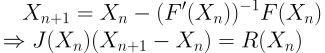

# hydra
Pipe network analysis of hydraulics network.

According to given property of pipes and boundary conditions, *hydra* can solve the flowrate (steady state) on each pipe in a hydraulic network.

Currently, only CPU version is provided, but it is already capable to solve even a large scale network.

<!-- -->

## How to use this?

* Linux
  ```
  make cpu
  ./test_cpu.exe ./data/network1.dat
  ```

* Windows (MinGW-win64)
  ```
  mingw32-make
  ./test_cpu.exe ./data/network1.dat
  ```

## Todos

* Use cuSolverSP to solve for large scale network.
(As we test, bicg is difficult to converge in large scale case, though it is suitable to be parallelized.)

## How does *hydra* work?

### Kirshoff's first law (Law of conservation, node equations)

Based on conservation of flow rate, summation of flow rate on a node should be zero.
Thus, we can obtain node equations for every node (if boundary condition is pressure, then source nodes are excluded.).

 <!---->

### Kirshoff's second law (loop equations)

To satisfy Kirshoff's second law, total presure drop (head loss) of any loop should be zero.
Thus, we can obtain loop equations for every loop (we only include independent loops to solve unknowns.).

 <!---->

### Head loss in pipe

The pressure drop of a pipe can be calculated according to 

* Darcy–Weisbach equation

 <!---->

or

* More general form 

 <!---->

(r is combination of the coefficients, n is usually between 1.5 to 2)

(p.s. n = 1 => Hagen-Poiseuille Equation; n = 1.85 => Hazen-Williams equation; n = 2.0 => Darcy-Weisbach equation)

### Independent loops searching

1. Construct BFS spanning tree
1. For every pipe that is not included in the spanning tree, use the two endpoints of that pipe as starting point and end point.
1. Then find lowest common ancestor of the starting point and end point, the travelled path is the loop we want to find. (connect the endpoints also)

### Use Newton's method to solve system of non-linear equations

We have to solve system of non-linear equations.

 <!---->

We use incidence matrix to store coefficients (+r, -r, +1, -1) and a vector to store constants (bounary conditions) in node equations and loop equations.

<!---->

We compute residual matrix R and its jacobian J at every x.

### Solver for updates in Newton's method

We implement Gaussian ellimination (with partial pivoting) and Biconjugate gradient method to solve.

For large scale network (number of pipe > 300), we thus suggest to use Gaussian ellimination.

### Boundary condition

We support two kind of boundary conditions:

1. Flowrate at node
  ```
  nNeq = nN - 1
  nLeq = nE - nNeq
  (nN: #nodes, nE: #edges (unknows), nNeq: #node_eq, nLeq: #loop_eq)
  ```
  * One node equation should be excluded because it is dependent to the others.

1. Pressure at node

  ```
  nNeq = nN - nN0
  nLeq = nL + nN0 - 1
  ```
  * Additional (number of sources - 1) loops pass through different sources should be included.
  * Node equation on source nodes should be excluded.

### Special cases that can generate equivalent network

Currently, we have support the function for converting following conditions into equivalent network,
so you have to convert these conditions by yourself.

1. parallel pipes between two nodes

  We only support single pipe between two nodes.
  But you still can convert it to equivalent structure and retrive the actual results based on it.
  
   <!---->

1. long serial pipes between two nodes

   <!---->

1. multiple sources on one node

  Just sum them up.
  
1. multiple separated networks

  Just put them into different network.dat.
  
## Example: network4.dat

 <!---->
 <!---->

